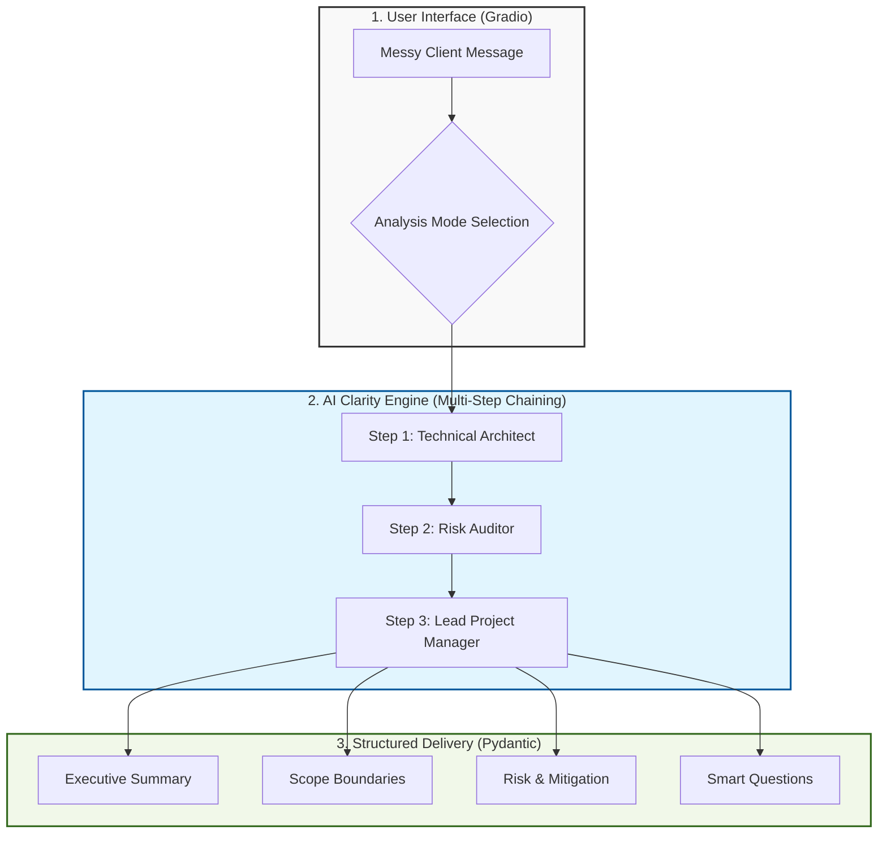

# 🚀 FlowixPro: The AI Project Clarity Engine

**Turn messy client messages into professional, structured project plans in seconds.**

FlowixPro is an AI-powered tool designed for freelancers and agencies who are tired of "scope creep" and vague client requirements. Whether it's a chaotic WhatsApp message, a rambling email, or a half-baked Upwork post, FlowixPro decodes the chaos and gives you instant clarity.

---

## ✨ Key Features
- **🎯 Multi-Mode Analysis**: Choose exactly what you want to extract:
  - **Summary**: Executive-level project goals.
  - **Scope**: Clear "In-Scope" vs. "Out-of-Scope" boundaries.
  - **Risks**: Ruthless audit of technical and financial red flags.
  - **Gaps**: Identification of missing info needed for quotes.
  - **Questions**: Strategic questions to send back to the client.
- **🧠 Multi-Step AI Pipeline**: Uses a chain of "AI Experts" (Architect, Auditor, and PM) for superior accuracy.
- **🛡️ Risk Mitigation**: Doesn't just find risks—it suggests professional mitigation strategies.
- **⚡ Instant Gradio UI**: A clean, functional interface for immediate use.

---

## 🏗️ System Architecture
FlowixPro uses a sophisticated **Sequential Chaining** model to process information:



---

## 🛠️ Technology Stack
- **LLM**: OpenAI GPT-4o-mini
- **Orchestration**: LangChain
- **UI**: Gradio
- **Data Validation**: Pydantic V2
- **Environment**: Python 3.9+

---

## 🚀 Getting Started

### 1. Clone the repository
```bash
git clone https://github.com/your-username/FlowixPro.git
cd FlowixPro
```

### 2. Install dependencies
```bash
pip install -r requirements.txt
```

### 3. Setup Environment Variables
Create a `.env` file in the root directory and add your OpenAI API Key:
```env
OPENAI_API_KEY=your_api_key_here
```

### 4. Run the application
```bash
python flowixpro_app.py
```

---

## 🤝 Contributing
Contributions are welcome! Feel free to open an issue or submit a pull request to help improve the Clarity Engine.

## 👤 Author
**Iqrar Abbas**  
*AI Design Architect*  
[Your LinkedIn/Portfolio Link]

---
*Developed with a focus on humanizing AI for better freelancer-client relationships.*
